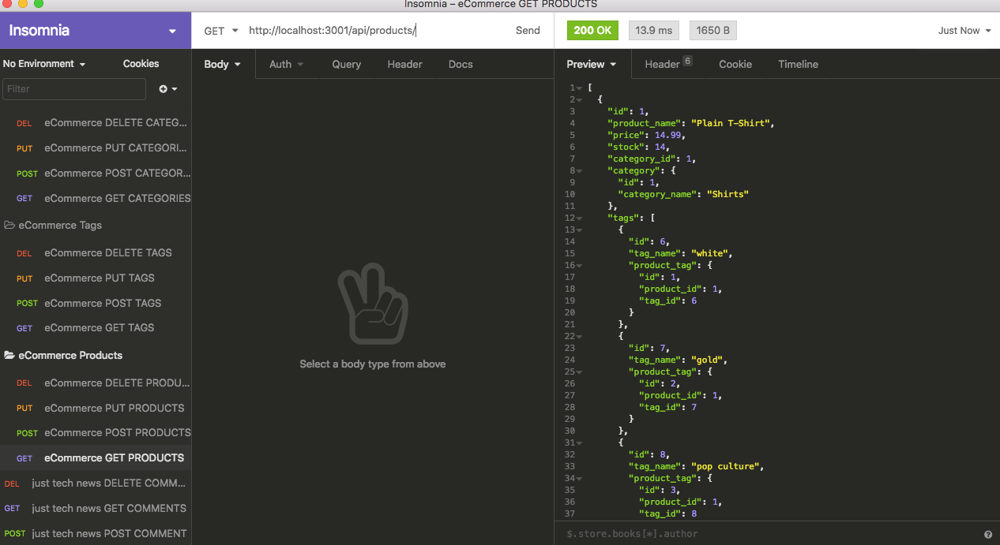
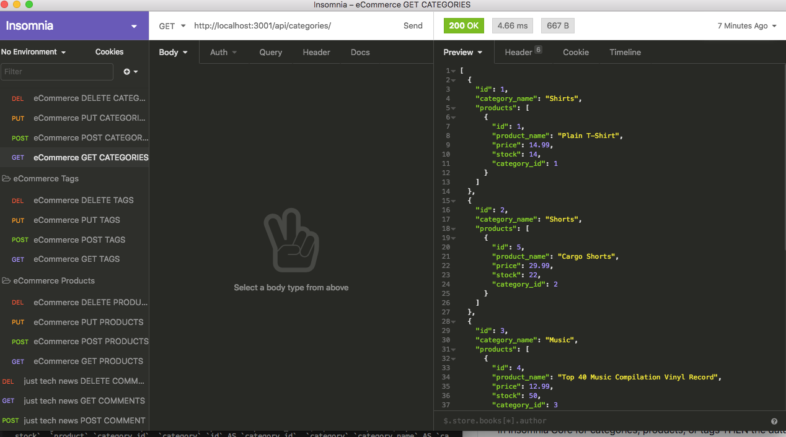

# eCommerce-Backend
* A backend database application for E-commerce.

## Description
* This is a backend application intended to be linked with the frontend of an E-commerce site.  When tied together, users will be able to create, read, update and delete categories, products and tags

## Links
* [GitHub Repo Link](https://github.com/taylornyquist/eCommerce-Backend)
* [Link to VS Video](https://drive.google.com/file/d/1Wv7Afm85K-D8bz-vgxOYT_jLho0Jmzmz/view)
* [Link to Insomnia Video](https://drive.google.com/file/d/1zfY_MkK4b9Y_KjxbVJg698lBmiaCqP5o/view)





## Table of Contents

* [Usage](#usage)
* [Installation](#installation)
* [Run](#run)
* [Technology](#technology)
* [Questions](#questions)
* [Contribution](#contribution)

## Usage
Go to GitHub to clone the repo on your machine.

## Installation
To install necessary dependencies, run the following command:
```
npm init
```
```
npm install
```
This should install the following dependencies into package.json:
```
 "dependencies": {
    "dotenv": "^8.2.0",
    "express": "^4.17.1",
    "mysql2": "^2.1.0",
    "sequelize": "^5.22.3"
  }
```

## Run
To run the application as a local host, run:
```
mysql -u root -p
```
```
source db/schema.sql
```
```
quit
```
```
npm run seed
```
```
npm start
```

## Technology
This application used the following technology:

* JavaScript
* Node.js
* Express.js
* Dotenv
* Sequelize
* MySQL 2


## Questions
If you have any questions about the repo, open an issue or contact me directly at tnyquist@gmail.com.  You can find more of my work at [taylornyquist](https://github.com/taylornyquist).


## Contribution
* Taylor Nyquist